## Overview

MonoFSM is a comprehensive Finite State Machine (FSM) framework for Unity, designed to simplify the implementation of complex game behaviors and logic. The framework provides a visual and modular approach to designing state machines, making it easier to create, debug, and maintain game systems.

[Nine Sols](https://store.steampowered.com/app/1809540/Nine_Sols/) is the first project to use this framework, and it has been developed and tested in the context of that game.

## Pre-requirement Dependencies

### Paid Tools
* [Odin-Inspector](https://odininspector.com/)

### Free Tools
* Unity Official Package
  * Unity.Addressable
  * Unity.Timeline
* ThirdParty Tools
  * [UniTask](https://github.com/Cysharp/UniTask)
  * [ZString](https://github.com/Cysharp/ZString)
  * [PrimeTween](https://github.com/KyryloKuzyk/PrimeTween)

### Included in Project (with modification)
* Auto Attribute
* GuidManager
* System.Runtime.CompilerServices.Unsafe

## Installation

### Prerequisites

Before installing MonoFSM, you must install the required dependencies:

1. **Install Odin Inspector** (Paid)
   - Purchase and install [Odin Inspector](https://odininspector.com/) from the Asset Store

2. **Install Unity Official Packages**
   - Open Package Manager → Unity Registry
   - Install `Addressables` package
   - Install `Timeline` package

3. **Install Third-Party Packages**
   - **UniTask**: Add `https://github.com/Cysharp/UniTask.git?path=src/UniTask/Assets/Plugins/UniTask` via Package Manager
   - **ZString**: Add `https://github.com/Cysharp/ZString.git?path=src/ZString/Assets/Scripts/ZString` via Package Manager  
   - **PrimeTween**: Add `https://github.com/KyryloKuzyk/PrimeTween.git` via Package Manager

### Install MonoFSM

* **Quick Setup**: Install through Unity Package Manager with git url
* **For Contributors**: Use "git submodule" to include this module into your project, and add as local package through Unity Package Manager

## Why Use MonoFSM?

1. **Seamless Integration in Unity's Scene Hierarchy**
   
   MonoFSM appears directly in Unity's Scene hierarchy, allowing roles like *programmers*, *designers*, and *artists* to work on the same objects naturally. This fosters organic information sharing within the project and reduces the need for extensive documentation.

2. **Prefab-Based Extensibility and Reusability**
   
   By leveraging Unity's Prefab and Prefab Variant system, MonoFSM overcomes the traditional FSM limitations of poor reusability and difficulty in expansion, making it straightforward to build and extend state machines.

3. **Intent-Driven Dependency Injection (DI)**
   
   Using GameObjects as the foundation allows for clear and intuitive dependency injection. Object activation and deactivation become explicit expressions of intent, which can be further interpreted and adapted later.

4. **Tight Integration with Unity's Native Tools**
   
   Because MonoFSM is built on GameObjects, it naturally supports Unity's Animation Clips and Timeline. This enables designers to create timeline-driven state machines with fine-grained, time-based control suitable for level design and gameplay micro-adjustments.

## Core Features

### Visual State Management

MonoFSM integrates directly into Unity's Scene hierarchy, making state machines visible and editable as GameObjects.

- **GameObject-based States**: States appear as GameObjects in the hierarchy, enabling intuitive drag-and-drop design
- **Complete Lifecycle**: Full support for OnStateEnter, OnStateUpdate, OnStateExit, and OnStateFinally methods
- **Safe Transitions**: Provides both safe and overwrite transition modes to prevent state conflicts

### Variable System

Powerful variable management with cross-state data sharing and real-time monitoring capabilities.

- **Typed Variables**: Built-in support for VarBool, VarInt, VarFloat, VarString, VarTransform, and custom types
- **Dynamic Binding**: Variable binding system with change listeners for reactive programming
- **Tag Organization**: VariableTag system for efficient variable categorization and lookup

### Action & Condition Framework

Flexible action execution system with conditional logic for complex gameplay behaviors.

- **Conditional Execution**: Actions execute only when specified conditions are met
- **Async Support**: Integrated with UniTask for delayed execution and non-blocking operations  
- **Extensible Architecture**: Easy custom action creation through AbstractStateAction inheritance

### Object Pool Management

High-performance object pooling system with automated lifecycle management.

- **PoolBank Automation**: Scene-level pool configuration with automatic prewarming data generation
- **Memory Optimization**: Smart pool sizing to reduce memory fragmentation and GC pressure
- **Transform Management**: Automatic capture and restoration of object Transform states

### Unity Native Tools Integration

Deep integration with Unity's built-in systems unlocks new possibilities for expressive state machine design.

- **Animation Clips**: Direct state-to-animation mapping with automatic playback control and transition handling
- **Timeline Integration**: Timeline-driven state machines for cinematic sequences and complex scripted events
- **Prefab Variants**: Leverage Unity's Prefab Variant system to create reusable state machine templates with inheritance

### Editor Tools Integration

Comprehensive editor toolset for enhanced development workflow and debugging experience.

- **Visual Debugging**: Real-time state machine monitoring with custom hierarchy display
- **Auto Attributes**: Automatic component reference resolution and hierarchy relationship management
- **Custom Drawers**: Rich Inspector experience with specialized property drawers and selectors

## Getting Started

### Example 1: SimpleDoor

This tutorial walks you through creating a simple door FSM that demonstrates MonoFSM's core concepts.

#### Scene Preparation

First, add the `SinglePlayer World Simulator.prefab` to your scene (located in the project).
*MonoFSM's lifecycle is controlled through this component*

#### Create New Prefab

1. Right-click on `Packages/MonoFSM/0_MonoFSM_Example_Module/General FSM.prefab`
2. Select **[Create] > [Prefab Variant]**

3. Rename the generated `General FSM Variant` to your desired object name, for example:
   `General FSM Variant - Door.prefab`
4. Move it to your project's appropriate location, such as:
   `Assets/FSMs/Puzzles/General FSM Variant - Door.prefab`

#### Configure States

Edit the `[General FSM Variant - Door.prefab]`:

**[States]**
Copy and rename existing states to create: `[State] Closed`, `[State] Opening`, `[State] Opened`, `[State] Closing`

#### Setup Variables

**[Variables]**
1. Click the Variables node
2. In Inspector → AddChild → Add VarBool named `[VarBool] Should Open`

#### LogicRoot Setup

**[LogicRoot]**
Add SpriteRenderer and Collider2D components to represent the door's visual and physical properties.

#### Animator Configuration

**[Animator]**
Create four Animation Clips corresponding to each state. Remember to turn off LoopTime on the Animation Clips (unless you really need looping).

#### Bind States to Animations

**[State & Animation Binding]**
Connect each state with its corresponding animation.

By default, each **[State]** node contains an **[Anim]** child node where you can configure:
- **Animator**: The Animator component to control
- **State Name**: The animation state name to execute

If you cannot find the **[Anim]** node under your State, you can create it manually:
1. Select the **[State]** node
2. In Inspector → click **AddChild: IRenderAction**
3. Choose **AnimatorPlayAction** to generate the Anim node

#### Configure Transitions

**[State & Transition Binding]**
- Define that Opening animation completion transitions to Opened state
- Define that Closing animation completion transitions to Closed state

**Step-by-step setup:**
1. Select the **[Anim]** node under your State
2. In Inspector → click **AddChild: StateTransition** → choose **StateTransition**
3. A new **State Transition** node will be created where you can:
   - Set the **Target State** (e.g., from Opening to Opened)
4. On the State Transition node → click **AddChild: AbstractConditionBehaviour**
5. Choose **AnimationDoneCondition**
6. This configuration will automatically transition to the target state when the animation completes

#### Setup Conditional Transitions

**[State, Variable & Transition Binding]**
Configure transitions and their corresponding conditions using the Should Open variable.

**Our goal is to set up the following logic:**
- **[State] Init**: Initial state that checks **[VarBool] Should Open** to decide whether to jump to **[State] Closed** or **[State] Opened**
- **[State] Closed**: When **[VarBool] Should Open** is **True**, transition to **[State] Opening**
- **[State] Opened**: When **[VarBool] Should Open** is **False**, transition to **[State] Closing**

**Step-by-step setup:**
1. Select the corresponding **[State]** node (Init, Closed, or Opened)
2. In Inspector → click **AddChild: TransitionBehaviour** → choose **TransitionBehaviour**
3. Select the newly created **TransitionBehaviour** node
4. Set the **Target State** (where you want to transition to)
5. In Inspector → click **AddChild: AbstractConditionBehaviour** → choose **VarBoolValueCondition**
6. In the **VarBoolValueCondition** settings:
   - Select **[VarBool] Should Open** from the VarBool dropdown field
   - Set whether the condition is met when the value is **True** or **False**

#### Result

Your SimpleDoor FSM is now ready! The door will respond to the Should Open variable changes and smoothly transition between states.

**Scene Location:** `MonoFSM/0_Getting Started Sample_Door Detect/SampleScene_SimpleDoor.unity`

### Example 2: SimpleButton

This tutorial demonstrates how to create a button FSM that interacts with the door from the previous example, showcasing variable relay binding between different FSM instances.

#### Step 1: Copy and Configure FSM Folder

Right-click on the previous Door folder and select **MonoFSM > 複製FSM資料夾**

The FSM folder copy tool window will appear. Change the new base name to `Button`

Set **Prefab copy mode** to **Direct Copy**
Set **Animator copy mode** to **Direct Copy**
Click **開始複製** (Start Copy)

#### Step 2: Rename Context

Open `General FSM Variant - Button.prefab` and rename the context:

**Variables Example:**
- `[VarBool] Should Open` → `[VarBool] Pressed`

**States Example:**
- `[State] Closed` → `[State] Released`
- `[State] Opened` → `[State] Pressed`
- `[State] Closing` → `[State] Releasing`
- `[State] Opening` → `[State] Pressing`

Also rename the FSM State, Animation Clips, and Animator States to define individual roles.

#### Step 3: Redesign Animations

Redesign the Button's view and redefine the Animation Clips content.

#### Step 4: Scene Setup and Variable Relay Configuration

Place both `General FSM Variant - Door.prefab` and `General FSM Variant - Button.prefab` in the scene
Create a parent GameObject named `[Variable Relay Binder]` and add:
- `VariableRelayBinder` component
- `MonoPoolObj` component

On the VariableRelayBinder, click **[AddChild]** and select **VarBoolRelay**
In the VarBoolRelay interface, bind:
- **Source**: `[VarBool] Pressed`
- **Target**: `[VarBool] Should Open`

#### Result

The button's `Pressed` state will trigger the door to open when activated.

### Example 3: Simple Key and Lock System

This tutorial demonstrates how to create an interactive key and lock system using MonoFSM's Effect Detection system, showcasing detector-detectable interactions and variable relay binding.

#### Part A: Creating the Lock (LockedButton)

##### Step 1: Copy FSM Folder
Right-click on `Puzzles/Button` folder and select **MonoFSM > 複製FSM資料夾** (Copy FSM Folder)

##### Step 2: Create LockedButton Variant
In the FSM Folder Copy Tool:
- Set new base name to `LockedButton`
- Use **Create Variant + Create Override Controller** mode
- Click **開始複製** (Start Copy)

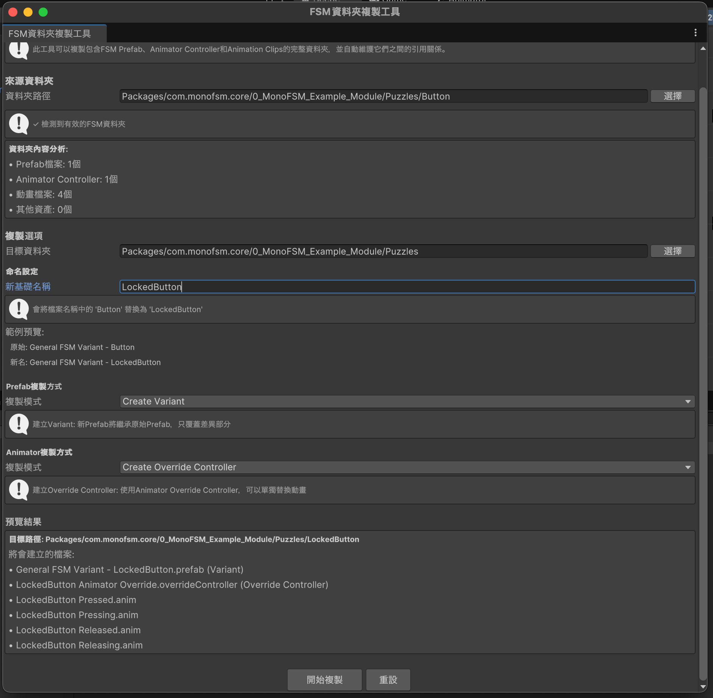

##### Step 3: Place in Scene
Drag the newly created `LockedButton.prefab` into your scene

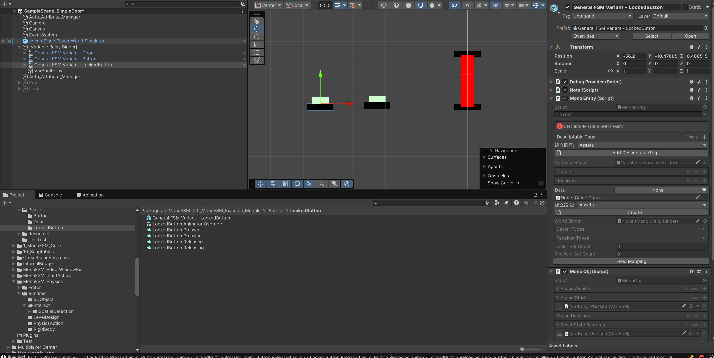

##### Step 4: Rename Variable
Open `LockedButton.prefab` and rename the variable:
- Change `[VarBool] Pressed` to `[VarBool] KeyInsert`

##### Step 5: Setup Physics Layers
1. In **Tags & Layers** settings, add two new layers:
   - `Detector`
   - `Detectable`

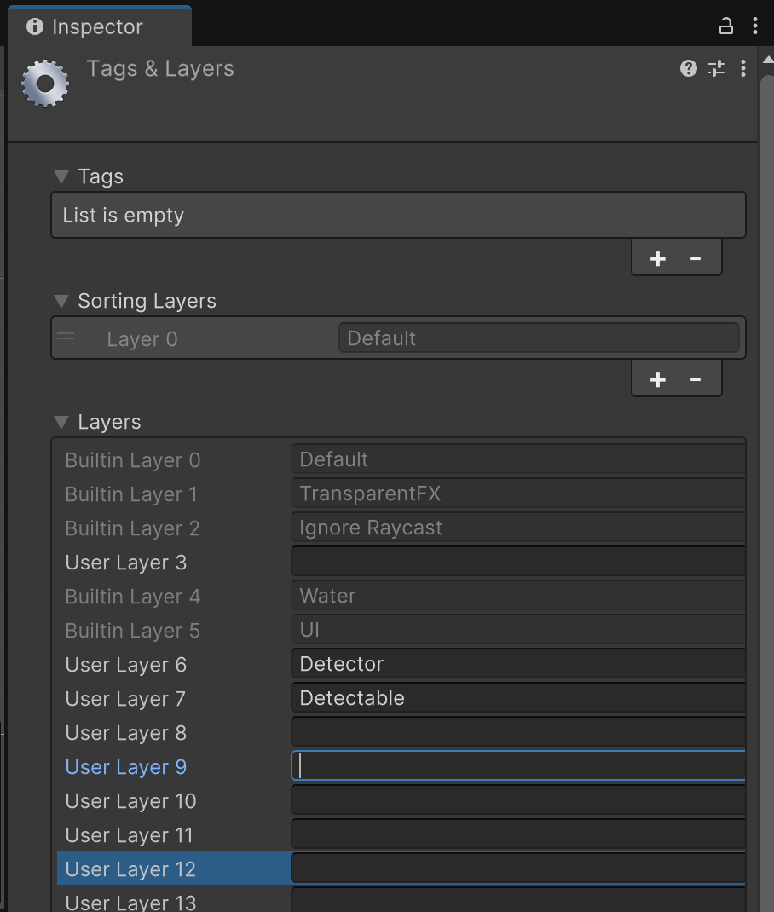

2. In **Physics Collision Matrix**, enable collision between Detector and Detectable layers

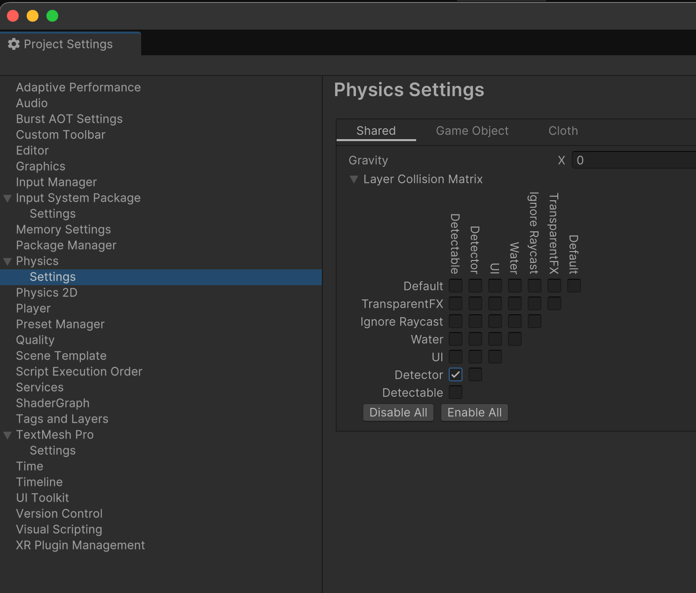

##### Step 6: Create Detector GameObject
Under `LogicRoot` node in `LockedButton.prefab`, add an empty GameObject named `Detector`

##### Step 7: Add Effect Detector Component
Add `Effect Detector` component to the `Detector` GameObject

##### Step 8: Configure Detection Source
1. Select `Detector` GameObject
2. In Inspector, notice the red warning
3. Click **AddChildDetentionSource** → select **TriggerDetector**
4. This automatically creates a TriggerDetector child node

##### Step 9: Setup Trigger Collider
On the `TriggerDetector` node:
1. Add **BoxCollider** component:
   - Enable `Is Trigger`
   - Set appropriate visual size
2. Add **Rigidbody** component:
   - Enable `Is Kinematic`
   - Disable `Use Gravity`

##### Step 10: Add Effect Dealer
1. Select `Detector` GameObject
2. In Inspector, click **AddChild:GeneralEffectDealer** → select **GeneralEffectDealer**
3. This creates a GeneralEffectDealer child node

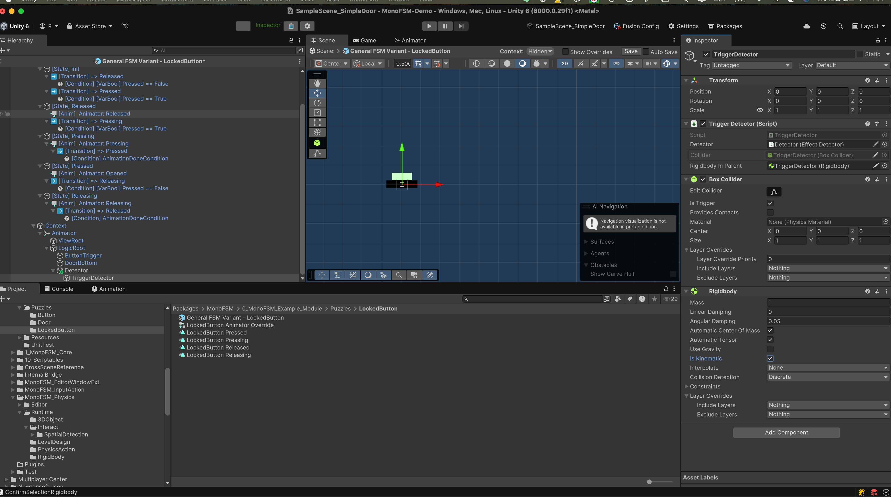

##### Step 11: Configure Effect Type
On `GeneralEffectDealer`:
1. Add new EffectType: `KeyAndLock`
2. Select `KeyAndLock` as the effect type

##### Step 12: Setup Enter/Exit Events
1. Select `GeneralEffectDealer`
2. In Inspector, click **AddEffectEnterNode** and **AddEffectExitNode**

##### Step 13: Configure Enter Event
1. Select `EffectEnterNode`
2. Click **AddChild:IEventReceiver** → choose **SetVarBoolAction**
3. Configure to set `[VarBool] KeyInsert` to **True**

##### Step 14: Configure Exit Event
1. Select `EffectExitNode`
2. Click **AddChild:IEventReceiver** → choose **SetVarBoolAction**
3. Configure to set `[VarBool] KeyInsert` to **False**

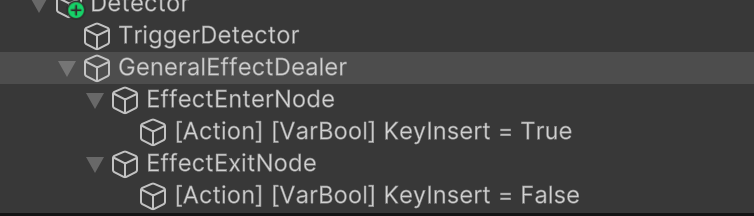

##### Step 15: Set Layer for Detector
Set all GameObjects under `Detector` node to use the `Detector` layer

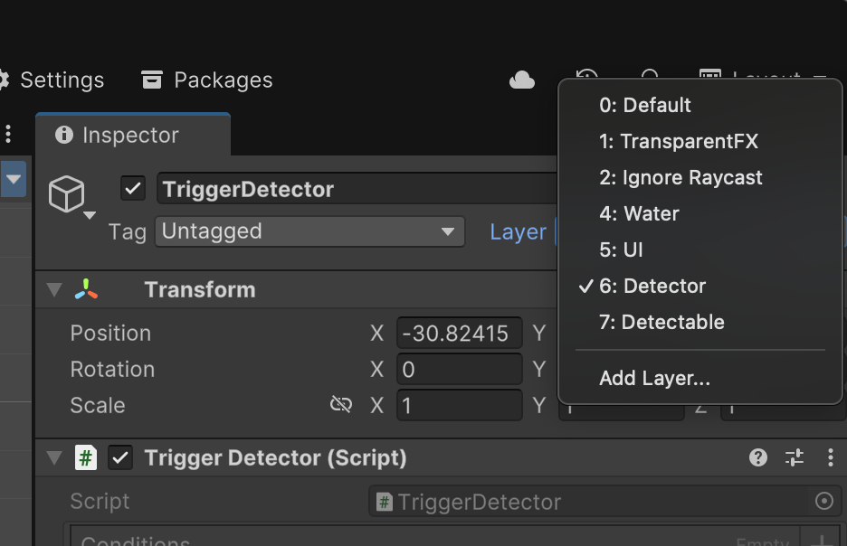

#### Part B: Creating the Key

##### Step 1: Create Key GameObject
1. Create empty GameObject in scene named `Key`
2. Add `SpriteRenderer` component for visual representation

##### Step 2: Add Detectable Node
Under `Key` GameObject, create child GameObject named `Detectable`

##### Step 3: Add Effect Detectable Component
Add `EffectDetectable` component to the `Detectable` GameObject

##### Step 4: Configure Detection Target
1. Select `Detectable` GameObject
2. In Inspector, click **AddChild:BaseEffectDetectTarget** → select **TriggerDetectableTarget**
3. This creates a TriggerDetectableTarget child node

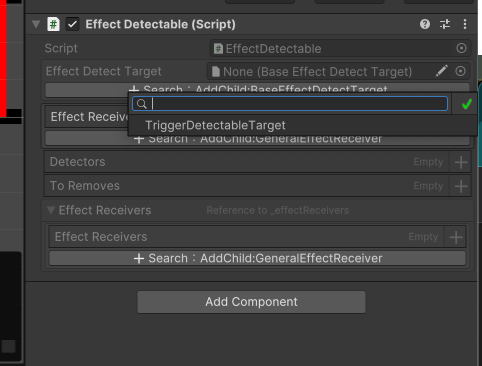

##### Step 5: Setup Detection Collider
On `TriggerDetectableTarget`:
1. Add **BoxCollider** component
2. Enable `Is Trigger`
3. Set appropriate detection range

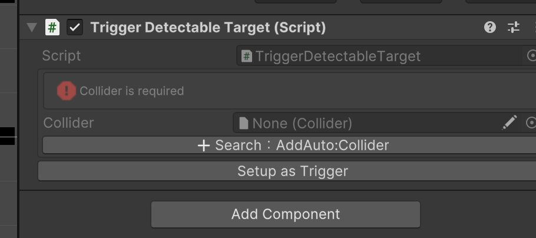

##### Step 6: Add Effect Receiver
1. Select `Detectable` GameObject
2. In Inspector, click **AddChild:GeneralEffectReceiver** → select **GeneralEffectReceiver**
3. This creates a GeneralEffectReceiver child node

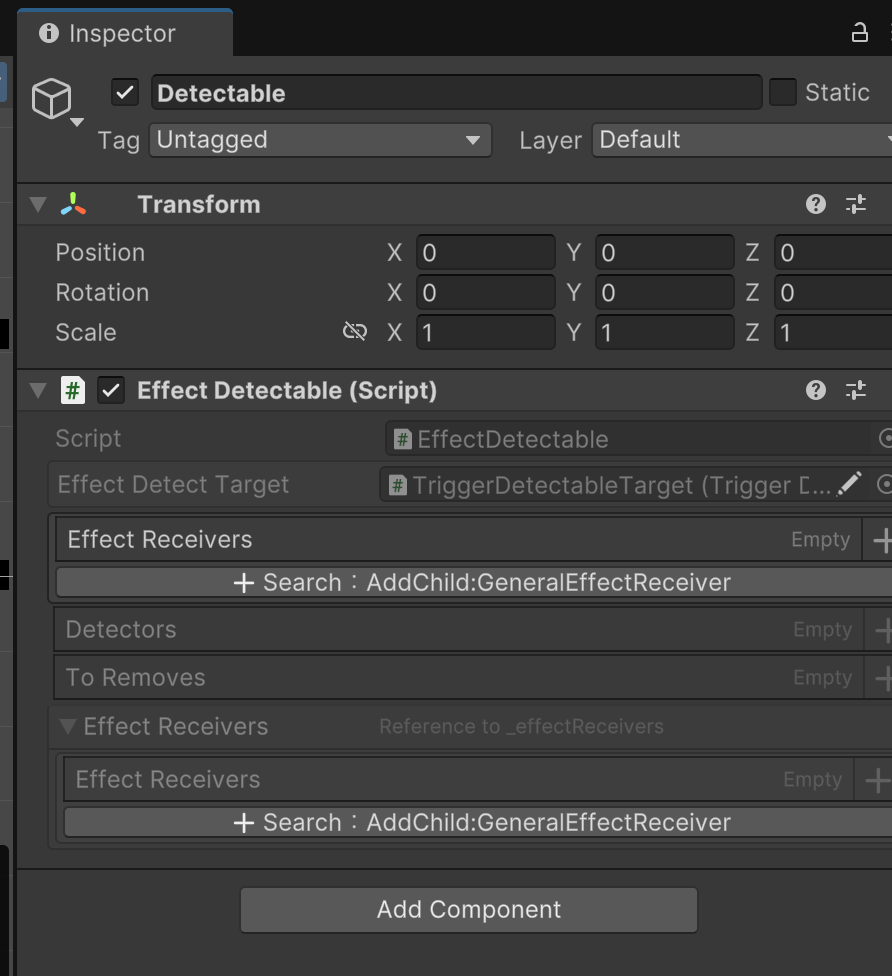

##### Step 7: Configure Receiver
1. Select `GeneralEffectReceiver`
2. In Inspector, click **AddChild:EffectEnterNode** → select **EffectEnterNode**

##### Step 8: Set Effect Type
On `GeneralEffectReceiver`, set EffectType to `KeyAndLock`

##### Step 9: Set Layer for Detectable
Set all GameObjects under `Detectable` node to use the `Detectable` layer

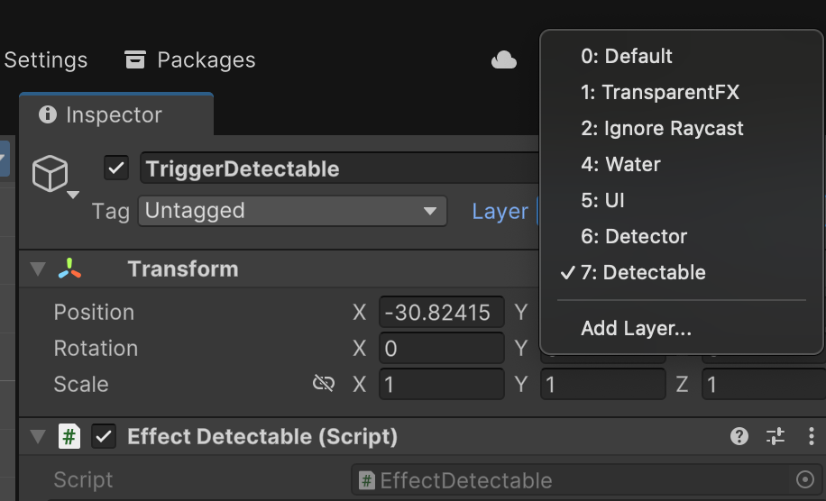

#### Part C: Binding LockedButton to Door

##### Variable Relay Configuration
Under `[Variable Relay Binder]`:
1. Add **VarBoolRelay** component
2. Configure relay:
   - Source: `[VarBool] KeyInsert`
   - Target: `[VarBool] Should Open`

This creates a connection where inserting the key into the lock triggers the door to open.

#### Result

The complete key and lock system allows the key to interact with the locked button, which in turn controls the door's open/close state through variable relay binding.

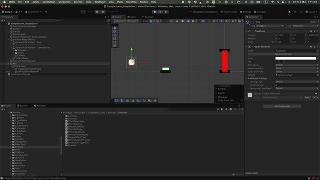

### Simple Player Controller Example

This tutorial demonstrates how to create a simple player controller with movement, jump, and dash abilities using MonoFSM.

#### Step 1: Create Player Prefab
1. Drag `General FSM.prefab` to create a prefab variant named `General FSM - Player.prefab`
2. Create corresponding states: `move`, `dash`, `jump`
3. In the `ViewRoot` node, use a Sprite Renderer to create the player's visual representation (we'll use a car shape for this example)

#### Step 2: Setup Physics Components
On the `Animator` node, add the following components:
- Animator
- RootMotionRelay
- RigidbodyMotionReceiver
- BoxCollider (set to match visual size)
- Rigidbody (enable `Use Gravity`)

#### Step 3: Configure Input Actions
In `InputSystem_Actions`, define the following actions:
- Move (Value/Vector2)
- Jump (Button)
- Sprint (Button)

#### Step 4: Setup Player Input
1. Under `General FSM - Player.prefab`, create a `PlayerInputs` node
2. Add the `PlayerInput` component

#### Step 5: Configure Input Actions
1. Under `PlayerInputs`, create `[Input] JumpData` node
   - Add components: `MonoInputAction`, `InputSystemInputActionImplementation`
   - Configure InputActionData and Input Action Reference properly

2. Under `PlayerInputs`, create `[Input] DashData` node
   - Add components: `MonoInputAction`, `InputSystemInputActionImplementation`
   - Configure InputActionData and Input Action Reference properly

#### Step 6: Create Animations
Create car animations for Move, Jump, and Dash
- Remember to disable `Loop Time` for all animations
- Bind animations to respective states: `[State] Move`, `[State] Dash`, `[State] Jump`

#### Step 7: Setup Move State Action
1. On GameObject `[State] Move`, in Inspector click **AddChild:OnStateUpdateHandler**
2. Create `PlayerMoveActionExample.cs` (see code in `0_MonoFSM_Example_Module/Actions/`)
3. Under `[Event] OnStateUpdate`, add `[Action] PlayerMoveActionExample` object
4. Add `PlayerMoveActionExample` component

#### Step 8: Setup Jump State Action
1. On GameObject `[State] Jump`, in Inspector click **AddChild:OnStateUpdateHandler**
2. Under `[Event] OnStateUpdate`, add `[Action] PlayerMoveActionExample` object
3. Add `PlayerMoveActionExample` component
4. Ensure all public references are properly configured (RigidBody and InputActionReference)

#### Step 9: Configure State Transitions

##### From Move State:
1. Add two Transition Behaviours under `[State] move`:
   - Transition to `[State] Jump`
   - Transition to `[State] Dash`
2. Use `[Condition] InputActionWasPressedCondition` for each transition with corresponding input actions

##### From Jump State:
1. Configure animation-based transition back to `[State] move` when animation completes
2. Add Transition Behaviour to `[State] Dash`
3. Use `[Condition] InputActionWasPressedCondition` for dash input

##### Air Dash Setup:
This configuration allows the player to dash while in the air (during jump state).

#### Step 10: Scene Setup
Remember to add a ground collider to prevent the player car from falling through the floor.

#### Final Result

The completed player controller allows for smooth movement, jumping, and dashing with proper physics interactions.

